# Nautilus Trinity Engine 架构图

**版本**: 1.0.0
**创建时间**: 2026-02-24
**作者**: Nautilus开发团队

---

## 📐 目录

1. [系统总体架构图](#1-系统总体架构图)
2. [Nexus Protocol 消息流转时序图](#2-nexus-protocol-消息流转时序图)
3. [智能体状态机图](#3-智能体状态机图)
4. [部署架构图](#4-部署架构图)
5. [数据流图](#5-数据流图)
6. [组件交互图](#6-组件交互图)

---

## 1. 系统总体架构图

### 1.1 Trinity Engine 三层架构

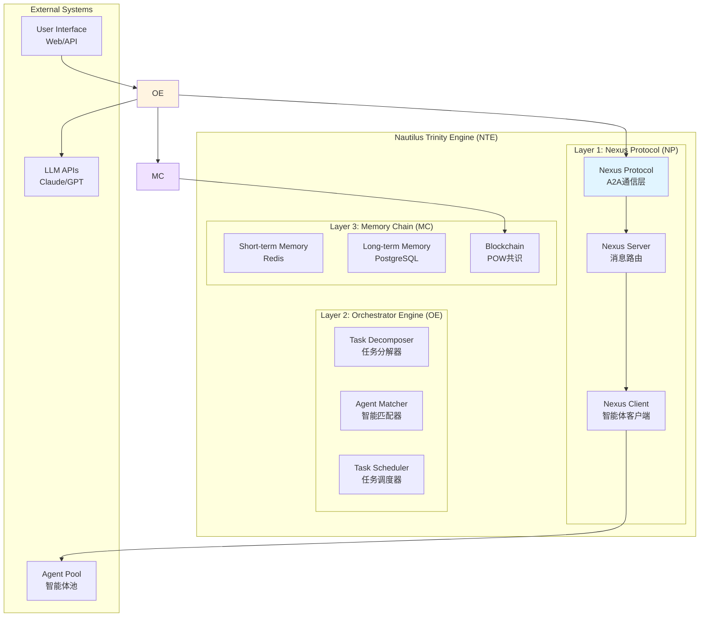

### 1.2 核心组件关系图

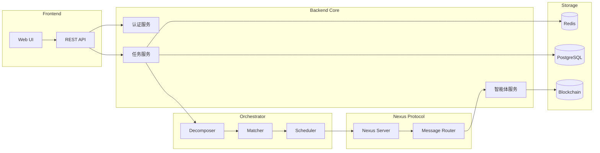

---

## 2. Nexus Protocol 消息流转时序图

### 2.1 A2A协作请求流程

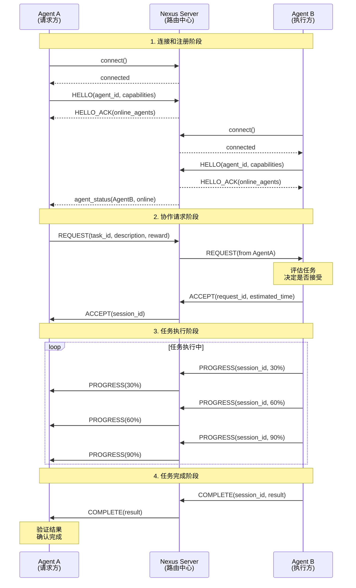

### 2.2 知识共享流程

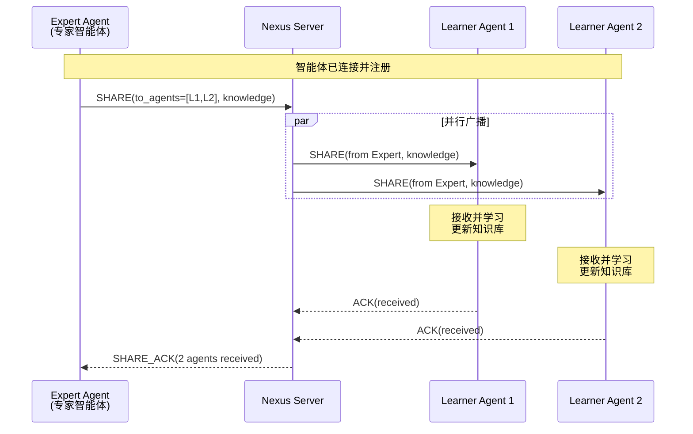

### 2.3 任务拒绝和替代方案流程

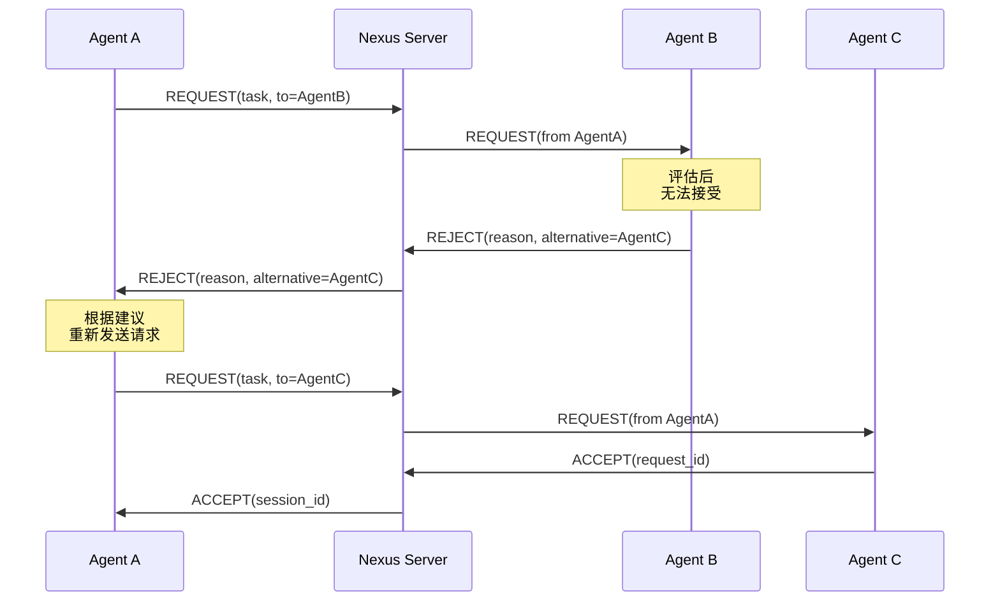

---

## 3. 智能体状态机图

### 3.1 智能体生命周期状态

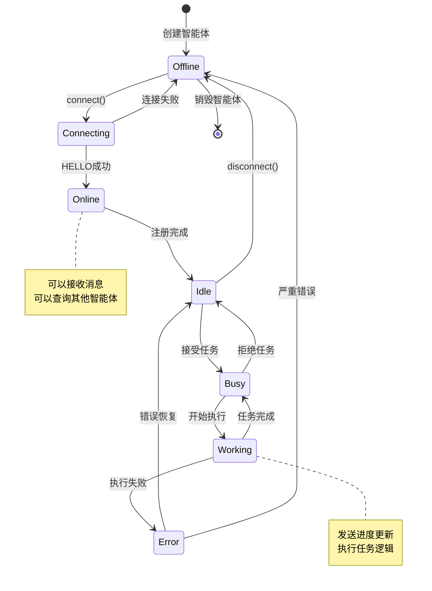

### 3.2 任务状态机

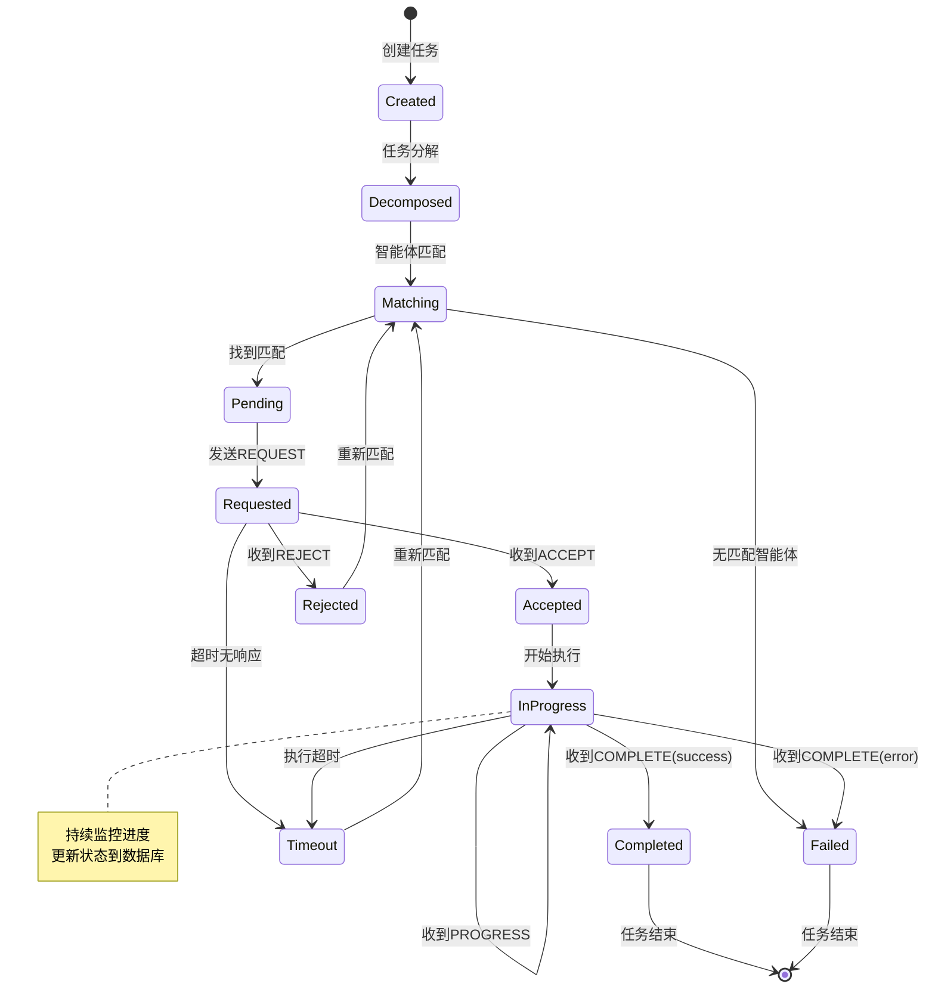

---

## 4. 部署架构图

### 4.1 生产环境部署

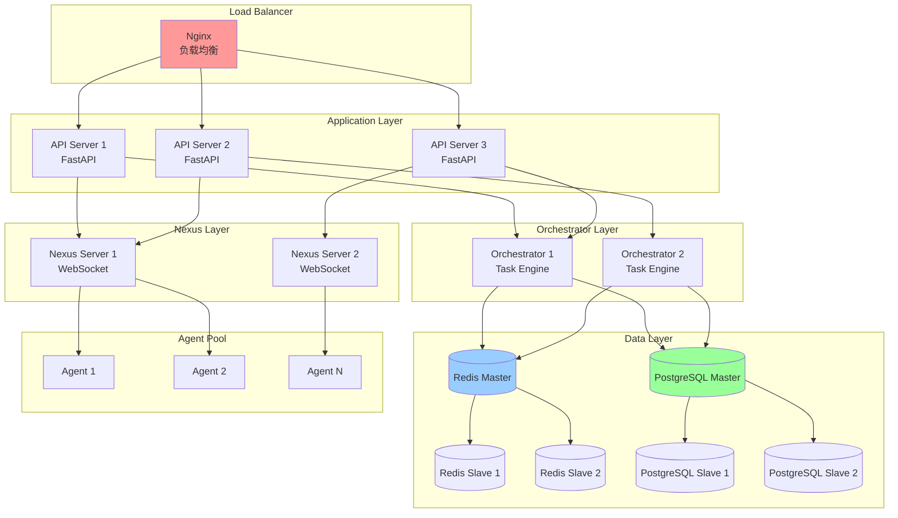

### 4.2 开发环境部署

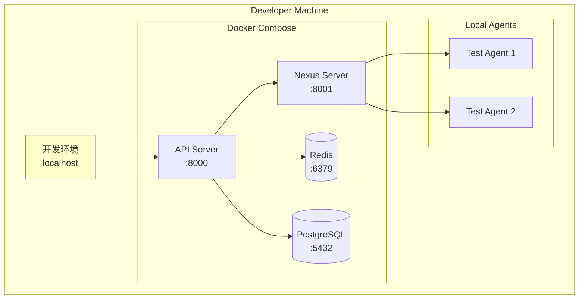

---

## 5. 数据流图

### 5.1 任务处理数据流

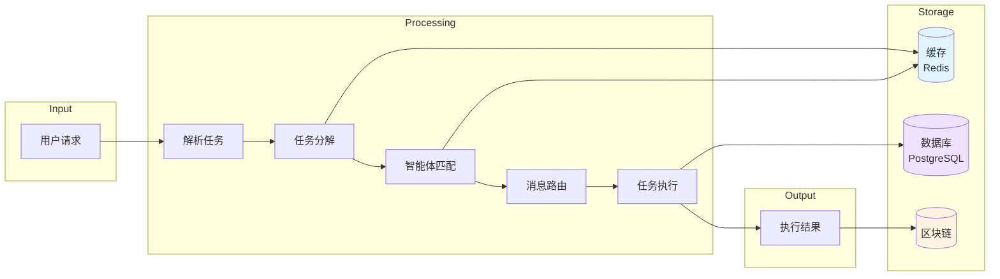

### 5.2 消息流转数据流

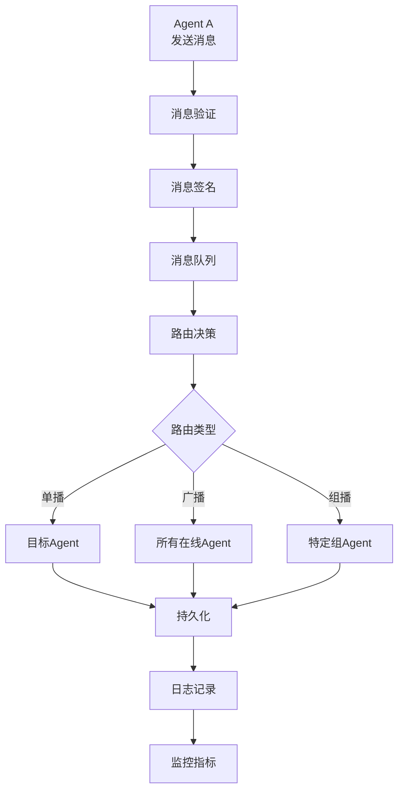

---

## 6. 组件交互图

### 6.1 Orchestrator Engine 内部交互

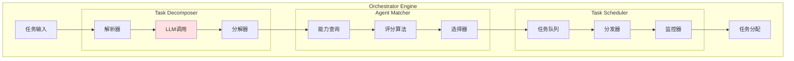

### 6.2 Memory Chain 交互

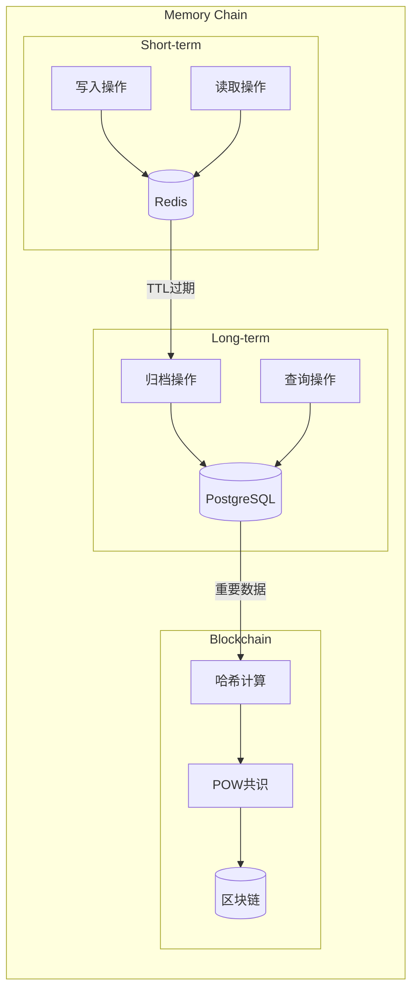

---

## 📊 架构特点总结

### 优势
1. ✅ **模块化设计**: 三层架构清晰分离
2. ✅ **可扩展性**: 每层可独立扩展
3. ✅ **高可用性**: 支持多实例部署
4. ✅ **异步通信**: WebSocket实时通信
5. ✅ **数据持久化**: 多层存储策略

### 技术栈
- **通信层**: Socket.IO, WebSocket
- **应用层**: FastAPI, Python 3.11+
- **存储层**: Redis, PostgreSQL, Blockchain
- **AI层**: Claude API, OpenAI API
- **部署**: Docker, Kubernetes

---

**文档版本**: 1.0.0
**最后更新**: 2026-02-24
**维护人**: Nautilus开发团队
