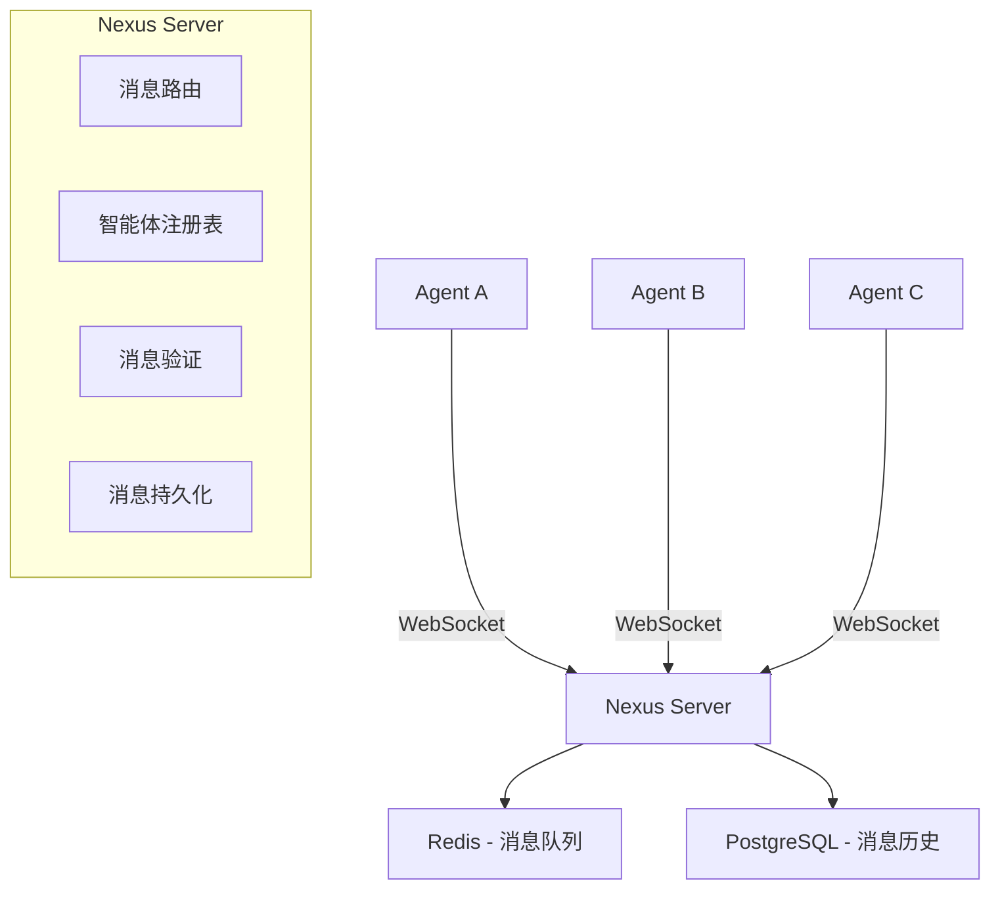
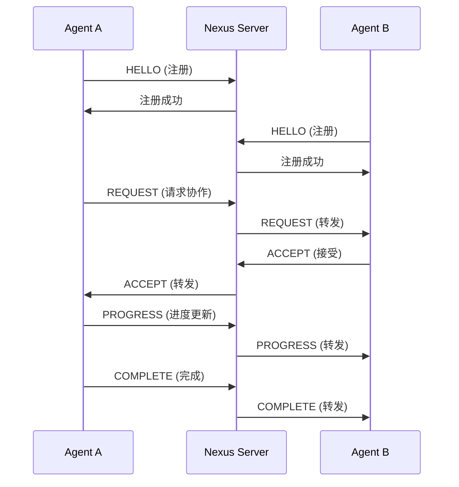

# Week 1 实施计划 - Nexus Protocol 开发

开始时间：2025-02-24
结束时间：2025-03-02

---

## 一、本周目标

### 核心目标
实现 Nexus Protocol 的基础A2A通信功能，让2个智能体可以互相发现、通信和协作。

### 验收标准
- [ ] 定义8种消息类型的协议规范
- [ ] 扩展WebSocket服务支持A2A消息
- [ ] 实现智能体注册和发现机制
- [ ] 2个智能体可以互相发送REQUEST和ACCEPT消息
- [ ] 单元测试覆盖率 > 80%
- [ ] 录制演示视频展示A2A通信

---

## 二、详细任务分解

### Day 1-2：协议设计与文档（2月24-25日）

#### Task 1.1：定义消息协议规范
**负责人**：[待分配]
**工作量**：4小时

**输出**：
1. 消息协议文档 `NEXUS_PROTOCOL_SPEC.md`
2. 消息类型定义
3. 数据结构设计

**详细内容**：

```python
# nexus_protocol/types.py

from enum import Enum
from pydantic import BaseModel
from typing import Optional, Dict, Any
from datetime import datetime

class MessageType(Enum):
    """Nexus Protocol 消息类型"""
    HELLO = "hello"           # 智能体注册和发现
    REQUEST = "request"       # 请求协作
    OFFER = "offer"          # 提供能力
    ACCEPT = "accept"        # 接受协作
    REJECT = "reject"        # 拒绝协作
    PROGRESS = "progress"    # 进度更新
    COMPLETE = "complete"    # 完成通知
    SHARE = "share"          # 知识共享

class NexusMessage(BaseModel):
    """Nexus消息基类"""
    type: MessageType
    message_id: str
    from_agent: str
    to_agent: str | list[str]  # 支持广播
    payload: Dict[str, Any]
    timestamp: datetime
    signature: Optional[str] = None

class HelloMessage(BaseModel):
    """HELLO消息 - 智能体注册"""
    agent_id: str
    name: str
    capabilities: list[str]
    status: str  # "online" | "busy" | "offline"
    metadata: Dict[str, Any]

class RequestMessage(BaseModel):
    """REQUEST消息 - 请求协作"""
    task_id: int
    task_type: str
    required_capability: str
    reward_share: float  # 0.0 - 1.0
    deadline: datetime
    description: str

class AcceptMessage(BaseModel):
    """ACCEPT消息 - 接受协作"""
    request_id: str
    estimated_time: int  # 秒
    conditions: Optional[Dict[str, Any]] = None

class RejectMessage(BaseModel):
    """REJECT消息 - 拒绝协作"""
    request_id: str
    reason: str
```

**验收标准**：
- [ ] 所有8种消息类型定义完整
- [ ] 数据结构使用Pydantic验证
- [ ] 文档包含示例和说明
- [ ] 团队评审通过

---

#### Task 1.2：设计架构图和流程图
**负责人**：[待分配]
**工作量**：2小时

**输出**：
1. 架构图（使用Mermaid或draw.io）
2. 时序图
3. 状态机图

**架构图示例**：


**时序图示例**：


---

### Day 3-4：核心功能开发（2月26-27日）

#### Task 2.1：扩展WebSocket服务
**负责人**：[待分配]
**工作量**：6小时

**文件**：`phase3/backend/nexus_server.py`

**实现内容**：

```python
# phase3/backend/nexus_server.py

import socketio
from fastapi import FastAPI
from typing import Dict, Set
import asyncio
import logging

logger = logging.getLogger(__name__)

class NexusServer:
    """Nexus Protocol 服务器"""

    def __init__(self):
        self.sio = socketio.AsyncServer(
            async_mode='asgi',
            cors_allowed_origins="*"
        )

        # 智能体注册表
        self.agents: Dict[str, Dict] = {}

        # 在线智能体
        self.online_agents: Set[str] = set()

        # 消息队列
        self.message_queue = asyncio.Queue()

        self._setup_handlers()

    def _setup_handlers(self):
        """设置事件处理器"""

        @self.sio.event
        async def connect(sid, environ):
            """客户端连接"""
            logger.info(f"Client connected: {sid}")
            await self.sio.emit('connected', {
                'message': 'Connected to Nexus Protocol'
            }, room=sid)

        @self.sio.event
        async def disconnect(sid):
            """客户端断开"""
            # 查找并移除智能体
            agent_id = None
            for aid, info in self.agents.items():
                if info.get('sid') == sid:
                    agent_id = aid
                    break

            if agent_id:
                self.online_agents.discard(agent_id)
                logger.info(f"Agent {agent_id} disconnected")

                # 广播智能体离线
                await self.broadcast_agent_status(agent_id, "offline")

        @self.sio.event
        async def hello(sid, data):
            """处理HELLO消息 - 智能体注册"""
            agent_id = data.get('agent_id')

            if not agent_id:
                await self.sio.emit('error', {
                    'message': 'agent_id is required'
                }, room=sid)
                return

            # 注册智能体
            self.agents[agent_id] = {
                'sid': sid,
                'name': data.get('name'),
                'capabilities': data.get('capabilities', []),
                'status': 'online',
                'metadata': data.get('metadata', {})
            }

            self.online_agents.add(agent_id)

            logger.info(f"Agent {agent_id} registered")

            # 返回注册成功
            await self.sio.emit('hello_ack', {
                'agent_id': agent_id,
                'status': 'registered',
                'online_agents': list(self.online_agents)
            }, room=sid)

            # 广播新智能体上线
            await self.broadcast_agent_status(agent_id, "online")

        @self.sio.event
        async def request(sid, data):
            """处理REQUEST消息 - 请求协作"""
            from_agent = data.get('from_agent')
            to_agent = data.get('to_agent')

            if not from_agent or not to_agent:
                await self.sio.emit('error', {
                    'message': 'from_agent and to_agent are required'
                }, room=sid)
                return

            # 检查目标智能体是否在线
            if to_agent not in self.online_agents:
                await self.sio.emit('error', {
                    'message': f'Agent {to_agent} is not online'
                }, room=sid)
                return

            # 转发消息
            target_sid = self.agents[to_agent]['sid']
            await self.sio.emit('request', data, room=target_sid)

            logger.info(f"REQUEST from {from_agent} to {to_agent}")

        @self.sio.event
        async def accept(sid, data):
            """处理ACCEPT消息 - 接受协作"""
            from_agent = data.get('from_agent')
            to_agent = data.get('to_agent')

            if to_agent in self.online_agents:
                target_sid = self.agents[to_agent]['sid']
                await self.sio.emit('accept', data, room=target_sid)
                logger.info(f"ACCEPT from {from_agent} to {to_agent}")

        @self.sio.event
        async def reject(sid, data):
            """处理REJECT消息 - 拒绝协作"""
            from_agent = data.get('from_agent')
            to_agent = data.get('to_agent')

            if to_agent in self.online_agents:
                target_sid = self.agents[to_agent]['sid']
                await self.sio.emit('reject', data, room=target_sid)
                logger.info(f"REJECT from {from_agent} to {to_agent}")

        @self.sio.event
        async def progress(sid, data):
            """处理PROGRESS消息 - 进度更新"""
            from_agent = data.get('from_agent')
            to_agent = data.get('to_agent')

            if to_agent in self.online_agents:
                target_sid = self.agents[to_agent]['sid']
                await self.sio.emit('progress', data, room=target_sid)

        @self.sio.event
        async def complete(sid, data):
            """处理COMPLETE消息 - 完成通知"""
            from_agent = data.get('from_agent')
            to_agent = data.get('to_agent')

            if to_agent in self.online_agents:
                target_sid = self.agents[to_agent]['sid']
                await self.sio.emit('complete', data, room=target_sid)
                logger.info(f"COMPLETE from {from_agent} to {to_agent}")

    async def broadcast_agent_status(self, agent_id: str, status: str):
        """广播智能体状态变化"""
        await self.sio.emit('agent_status', {
            'agent_id': agent_id,
            'status': status
        })

    def get_app(self):
        """获取ASGI应用"""
        return socketio.ASGIApp(self.sio)


# 创建全局实例
nexus_server = NexusServer()
```

**验收标准**：
- [ ] 支持8种消息类型
- [ ] 智能体注册和发现功能正常
- [ ] 消息路由正确
- [ ] 错误处理完善

---

#### Task 2.2：实现智能体客户端
**负责人**：[待分配]
**工作量**：4小时

**文件**：`phase3/agent-engine/nexus_client.py`

**实现内容**：

```python
# phase3/agent-engine/nexus_client.py

import socketio
import asyncio
from typing import Callable, Dict, Any
import logging

logger = logging.getLogger(__name__)

class NexusClient:
    """Nexus Protocol 客户端"""

    def __init__(self, agent_id: str, server_url: str = "http://localhost:8001"):
        self.agent_id = agent_id
        self.server_url = server_url
        self.sio = socketio.AsyncClient()
        self.handlers: Dict[str, Callable] = {}
        self.connected = False

        self._setup_handlers()

    def _setup_handlers(self):
        """设置事件处理器"""

        @self.sio.event
        async def connect():
            logger.info(f"Agent {self.agent_id} connected to Nexus")
            self.connected = True

            # 发送HELLO消息注册
            await self.send_hello()

        @self.sio.event
        async def disconnect():
            logger.info(f"Agent {self.agent_id} disconnected from Nexus")
            self.connected = False

        @self.sio.event
        async def hello_ack(data):
            logger.info(f"Registration confirmed: {data}")

        @self.sio.event
        async def request(data):
            """收到协作请求"""
            if 'request' in self.handlers:
                await self.handlers['request'](data)

        @self.sio.event
        async def accept(data):
            """收到接受消息"""
            if 'accept' in self.handlers:
                await self.handlers['accept'](data)

        @self.sio.event
        async def reject(data):
            """收到拒绝消息"""
            if 'reject' in self.handlers:
                await self.handlers['reject'](data)

        @self.sio.event
        async def progress(data):
            """收到进度更新"""
            if 'progress' in self.handlers:
                await self.handlers['progress'](data)

        @self.sio.event
        async def complete(data):
            """收到完成通知"""
            if 'complete' in self.handlers:
                await self.handlers['complete'](data)

        @self.sio.event
        async def agent_status(data):
            """智能体状态变化"""
            logger.info(f"Agent status changed: {data}")

    async def connect(self):
        """连接到Nexus服务器"""
        await self.sio.connect(self.server_url)

    async def disconnect(self):
        """断开连接"""
        await self.sio.disconnect()

    async def send_hello(self):
        """发送HELLO消息"""
        await self.sio.emit('hello', {
            'agent_id': self.agent_id,
            'name': f'Agent-{self.agent_id}',
            'capabilities': ['general'],
            'status': 'online'
        })

    async def send_request(self, to_agent: str, task_data: Dict[str, Any]):
        """发送REQUEST消息"""
        await self.sio.emit('request', {
            'from_agent': self.agent_id,
            'to_agent': to_agent,
            **task_data
        })

    async def send_accept(self, to_agent: str, request_id: str):
        """发送ACCEPT消息"""
        await self.sio.emit('accept', {
            'from_agent': self.agent_id,
            'to_agent': to_agent,
            'request_id': request_id
        })

    async def send_reject(self, to_agent: str, request_id: str, reason: str):
        """发送REJECT消息"""
        await self.sio.emit('reject', {
            'from_agent': self.agent_id,
            'to_agent': to_agent,
            'request_id': request_id,
            'reason': reason
        })

    def on(self, event: str, handler: Callable):
        """注册事件处理器"""
        self.handlers[event] = handler
```

**验收标准**：
- [ ] 可以连接到Nexus服务器
- [ ] 可以发送和接收所有消息类型
- [ ] 事件处理机制正常
- [ ] 错误处理完善

---

### Day 5：测试与文档（2月28日）

#### Task 3.1：编写单元测试
**负责人**：[待分配]
**工作量**：4小时

**文件**：`phase3/backend/tests/test_nexus_protocol.py`

**测试用例**：

```python
# phase3/backend/tests/test_nexus_protocol.py

import pytest
import asyncio
from nexus_server import NexusServer
from nexus_client import NexusClient

@pytest.mark.asyncio
async def test_agent_registration():
    """测试智能体注册"""
    server = NexusServer()
    client = NexusClient("agent-001")

    await client.connect()
    await asyncio.sleep(1)

    assert client.connected
    assert "agent-001" in server.online_agents

    await client.disconnect()

@pytest.mark.asyncio
async def test_a2a_communication():
    """测试A2A通信"""
    server = NexusServer()

    client_a = NexusClient("agent-a")
    client_b = NexusClient("agent-b")

    # 连接
    await client_a.connect()
    await client_b.connect()
    await asyncio.sleep(1)

    # Agent B 设置请求处理器
    request_received = False

    async def handle_request(data):
        nonlocal request_received
        request_received = True
        # 发送接受消息
        await client_b.send_accept(data['from_agent'], data['request_id'])

    client_b.on('request', handle_request)

    # Agent A 发送请求
    await client_a.send_request('agent-b', {
        'request_id': 'req-001',
        'task_id': 1,
        'description': 'Test task'
    })

    await asyncio.sleep(1)

    assert request_received

    await client_a.disconnect()
    await client_b.disconnect()

@pytest.mark.asyncio
async def test_message_routing():
    """测试消息路由"""
    # TODO: 实现消息路由测试
    pass

@pytest.mark.asyncio
async def test_error_handling():
    """测试错误处理"""
    # TODO: 实现错误处理测试
    pass
```

**验收标准**：
- [ ] 测试覆盖率 > 80%
- [ ] 所有测试通过
- [ ] 包含正常和异常场景

---

#### Task 3.2：编写文档和演示
**负责人**：[待分配]
**工作量**：2小时

**输出**：
1. API文档
2. 使用示例
3. 演示视频（5分钟）

**演示脚本**：
```python
# demo_a2a_communication.py

import asyncio
from nexus_client import NexusClient

async def demo():
    """演示A2A通信"""

    # 创建两个智能体
    agent_a = NexusClient("agent-a")
    agent_b = NexusClient("agent-b")

    # Agent B 设置请求处理器
    async def handle_request(data):
        print(f"Agent B received request: {data}")
        # 接受请求
        await agent_b.send_accept(data['from_agent'], data['request_id'])
        print("Agent B accepted the request")

    agent_b.on('request', handle_request)

    # Agent A 设置接受处理器
    async def handle_accept(data):
        print(f"Agent A received accept: {data}")
        print("Collaboration started!")

    agent_a.on('accept', handle_accept)

    # 连接
    print("Connecting agents...")
    await agent_a.connect()
    await agent_b.connect()
    await asyncio.sleep(2)

    # Agent A 发送协作请求
    print("\nAgent A sending collaboration request...")
    await agent_a.send_request('agent-b', {
        'request_id': 'req-001',
        'task_id': 1,
        'task_type': 'data_analysis',
        'description': 'Analyze sales data',
        'reward_share': 0.3
    })

    await asyncio.sleep(2)

    # 断开连接
    print("\nDisconnecting...")
    await agent_a.disconnect()
    await agent_b.disconnect()

if __name__ == "__main__":
    asyncio.run(demo())
```

---

## 三、每日站会安排

**时间**：每天上午10:00
**时长**：15分钟
**参与人**：开发团队

**格式**：
```markdown
## 2025-02-24 站会

### 张三
昨日完成：
- [x] 完成消息协议设计

今日计划：
- [ ] 实现WebSocket扩展

遇到的问题：
- 无

### 李四
昨日完成：
- [x] 完成架构图设计

今日计划：
- [ ] 实现智能体客户端

遇到的问题：
- 需要确认消息签名算法
```

---

## 四、周五演示准备

**时间**：2025-02-28 下午3:00
**时长**：30分钟

**演示内容**：
1. 架构图讲解（5分钟）
2. 代码走查（10分钟）
3. 实际演示（10分钟）
   - 2个智能体注册
   - Agent A 发送请求
   - Agent B 接受请求
   - 显示消息流转
4. 测试报告（5分钟）

**演示检查清单**：
- [ ] 演示环境准备好
- [ ] 演示脚本测试通过
- [ ] 录屏软件准备好
- [ ] PPT准备好

---

## 五、风险与应对

| 风险 | 影响 | 概率 | 应对措施 |
|------|------|------|----------|
| WebSocket连接不稳定 | 高 | 中 | 添加心跳检测和自动重连 |
| 消息丢失 | 高 | 低 | 实现消息确认机制 |
| 性能不达标 | 中 | 中 | 使用Redis做消息队列 |
| 时间不够 | 高 | 中 | 优先实现核心功能，其他功能下周 |

---

## 六、成功标准

### 功能完成度
- [ ] 8种消息类型全部实现
- [ ] 智能体注册和发现功能正常
- [ ] 2个智能体可以互相通信
- [ ] 消息路由正确

### 质量标准
- [ ] 单元测试覆盖率 > 80%
- [ ] 所有测试通过
- [ ] 代码审查通过
- [ ] 文档完整

### 演示标准
- [ ] 演示视频录制完成
- [ ] 演示流畅无卡顿
- [ ] 功能展示完整
- [ ] 团队满意

---

## 七、下周预告

**Week 2 目标**：
- 实现智能体能力查询
- 实现协作会话管理
- 实现消息持久化
- 性能优化和压力测试

---

**文档版本**: v1.0
**创建时间**: 2025-02-24
**负责人**: [待分配]
